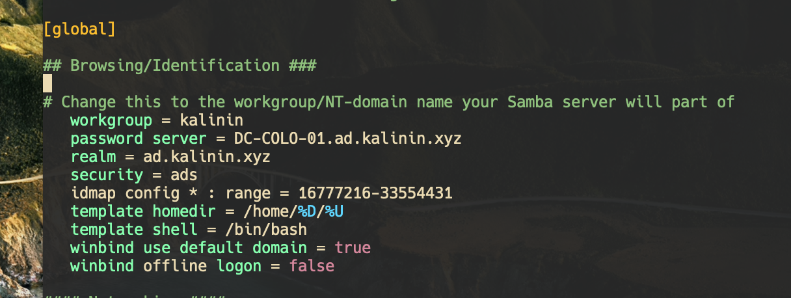

When setting up the NAS part of my [new all in one lab build](/posts/threadripper-build-storage), one thing I couldn’t find a simple guide for online was Active Directory permissions with SMB file shares in Debian. Hopefully this guide will help you out with a rather simple approach to the problem.

## Requirements

These are the things you should already have set up and running before diving into this. This guide is demonstrated on a Debian VM, but it will most likely work for Ubuntu. For other Linux operating systems, I cannot guarantee it will work as expected.

* A linux machine with a storage location. This could be either a physical machine, or a virtual machine.
* A working Active Directory setup, and a user with permissions to join the domain.

## Install packages

The first step is to make sure the necessary packages are installed. This step is quite easy, all you need to do is run the following command:

```
sudo apt install samba winbind libpam-winbind libnss-winbind krb5-config
```

## Initial Samba config 
The first step is to setup the Samba configuration to connect to your domain. To do this you will need to edit /etc/samba/smb.conf using the editor of your choice, such as vim or nano.
You need to add the following content to the file, with some pieces substituted for your own values.

```
[global]
   workgroup = YOUR_WORKGROUP
   password server = YOUR_DC.YOUR_DOMAIN.EXAMPLE
   realm = your.domain.here
   security = ads
   idmap config * : range = 16777216-33554431
   template homedir = /home/%D/%U
   template shell = /bin/bash
   winbind use default domain = true
   winbind offline logon = false
```

The workgroup should be your NetBIOS domain name, your password should be the hostname of your Domain Controller, and the realm should be your domain name.
For example, my domain has the NetBIOS name of KALININ, the domain name of ad.kalinin.xyz and the domain controller can be found at DC-COLO-01.ad.kalinin.xyz
After putting this information in, my smb.conf file has the following content:



## Name service configuration

The next step is to modify the name service config file (`/etc/nsswitch.conf`) to use winbind for authentication checking. The main things to change here are the lines for passwd, group, and shadow. These lines should say `files winbind sss`. Below is an example of what my configuration file looked like after the changes.


## Joining the domain

At this point, your system should be ready to join your domain. Just make sure you have the DNS configured to use the domain's DNS servers. 
The next step is to join the domain using `sudo net ads join -U <username>` where the username is for the account that has permission to domain join.
In my example, I used my username like so:


After doing this, if it was successful, you can either reboot, or restart all the appropriate services using the following commands.

```
sudo systemctl restart winbind
sudo systemctl restart smbd
sudo systemctl restart nmbd
```

## Create a file share

The next step is to add a file share and set appropriate folder permissions. When adding new file shares in the future this is the only part of the guide you will need to follow.

The first step is to create a new folder, and set the permissions accordingly. The commands you need are as follows, substituting in the values accordingly.

```
sudo mkdir {folder path}
sudo chmod -R 0770 {folder path}
sudo chgrp -R {group} {folder path}
```

Here is an example I did with the values substituted in. In this example I am creating a folder to keep my backups, and giving the Domain Users group access to it.


Once the folder is created and permissions set, we just need to add an entry to /etc/samba/smb.conf so that it is shared. The config section to add will look like the following:

```
[Share name here]
    comment = some comment here
    path = {folder path}
    valid users = {user group}
    force group = {user group}
    writable = yes
    read only = no
    force create mode = 0660
    create mask = 0777
    directory mask = 0777
    force directory mode = 0770
    access based share enum = yes
    hide unreadable = yes
```

With the values filled out for the backup example, it should look something like this.


After saving the file, you can now restart the service using `sudo systemctl restart smbd`, and your file share should now be working. Here you can see the newly created share showing up in windows file explorer.


