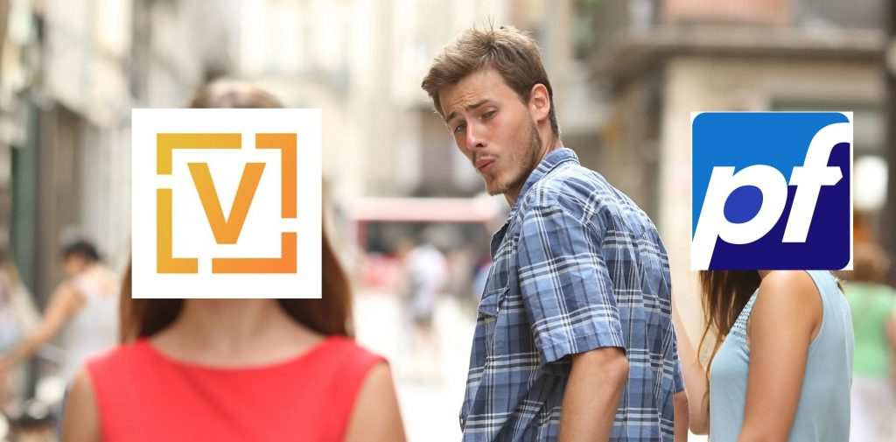
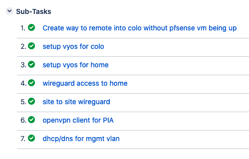
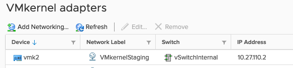
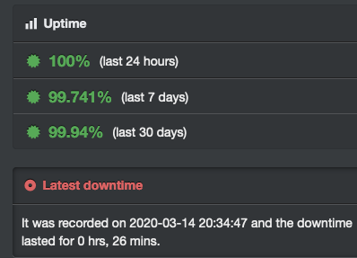
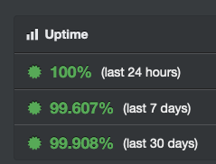

For a while now I’ve been meaning to switch from pfSense to VyOS for my lab routers, and had started playing around in a staging environment. I decided it’s finally time to bite the bullet and migrate the production environment.



# Why the switch?
So there were quite a few reasons for me wanting to switch, and some more benefits that I discovered along the way. Here is a quick summary of the reasons I wanted to switch:

* Config as code.  
Recently I’ve been moving a lot of my stuff to config as code solutions, mainly Terraform and Ansible. VyOS can help me keep going in this direction, as all of the config is in one file, that has a very clean structure. Yes, pfSense can have it’s config file exported and imported, but the config file looks hideous, and really isn’t designed for this usecase.

* Performance.  
While you can get good routing performance with pfSense, you generally need very good hardware to get even close to 10Gb. With VyOS routing 10Gb can be done on much more modest hardware. 
You can find a lot more info on this topic at [Kroy’s blog](https://blog.kroy.io/2019/08/23/battle-of-the-virtual-routers/).

* Wireguard support.  
pfSense just doesnt have good support for WireGuard VPN, and VyOS does.
Worth noting, it looks like Netgate are planning on sponsoring WireGuard kernel work fo FreeBSD, so it looks like they definitely plan on supporting it in pfsense, but there is no clear timeline for this.

* Better understanding of networking.  
With pfSense, I definitely feel that I learned a lot about networking, but it does a lot of the work for you. 
During this transition, it was made very clear to me that I didnt understand nearly enough, as pfSense was hiding a lot of the complexity.r

# Requirements and complications
So the main thing holding me back from switching for a while, was the amount of stuff going on with my lab networking setup. 

There are 2 sites, with VPN between them and BGP routing, as well as remote access VPN connections to both sites.

There are also policies in place to route certain traffic over PIA VPN, as well as the standard port forwarding/NAT/VLAN requirements.

Having all these existing requirements meant I would need to set this all up again in VyOS just to have feature parity with the existing setup.

One complication I had to consider was how I was gonna migrate my 2nd site.
This site happens to be my server that I have in colocation in a datacenter. This means my only way to access it without paying a visit to the location was the VPN connection going to my pfSense router.

All of these requirements had been sitting in my Jira board for quite some time now, and it didn’t help with the motivation to finally migrate.



# The big migration
So over the weekend, I decided it’s finally time. The first thing I decided to do was figure out how to transition the site in colocation without locking myself out. 

I realised I had already setup a staging environment using one of my other IPs at the colocation that had remote access, so I could reuse that setup to have access to the setup with my main router offline. So I gave my ESXi host a management interface on that network, and made sure I could manage everything through the staging network.



Once this was done, I ensured that the pfSense VM was set to autostart when the host boots up, and after confirming I shut down the pfSense VM. By doing it this way, I could remotely reboot the server and the old pfSense setup would come back up, allowing me access again.

Success! The transition for the colocation site went off without any problems, and minimal downtime for that site. Not bad at all.



Next up, the home site. This was a much easier process, as I had local access to all the management stuff without worrying about locking myself out. This generally worked out quite well too, with not a lot of downtime here either.



After these were done, it was time to configure the site to site connections. With pfSense, these were all done with OpenVPN, but since VyOS has built in WireGuard support, I went with that for all the connections I could. I found the config much simpler implement, as the authentication was just public/private keys.

# Conclusion

I think overall this was all definitely worth doing for the reasons I listed earlier, and the transition went smoother and quicker that I was excepting. One thing I really found I love with VyOS is the zone based firewall rules.

In pfSense I would need to setup firewall rules between all interfaces, including any VPN ones. With zone based rules, it meant i could apply the rules to zones instead, and place those interfaces in their appropriate zones.

 ```
zone LAN {
     default-action drop
     from LOCAL {
         firewall {
             name LOCAL-LAN
         }
     }
     from WAN {
         firewall {
             name WAN-LAN
         }
     }
     interface eth0.1000
     interface wg0
     interface eth0.1255
     interface wg1
 }
 ```

In this configuration snippet you can see I added multiple VLANs and the wireguard interfaces to the LAN zone. This meant they would be treated as being in the same security group.

In pfSense, I would have had to make firewall rules between all these interfaces individually. I think this is a lot cleaner.

The only thing I hadn’t sorted out by the end of the weekend was routing certain traffic over PIA. Expect a post about this shortly.

