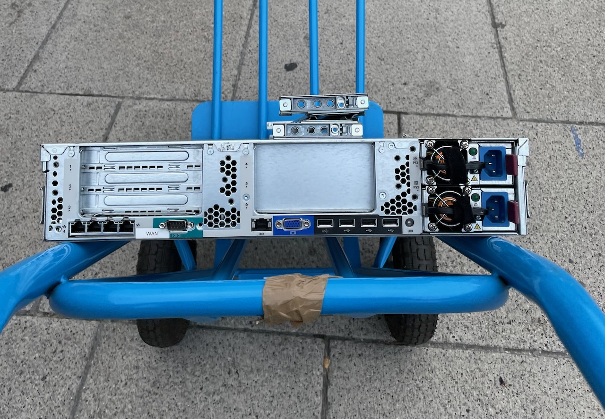
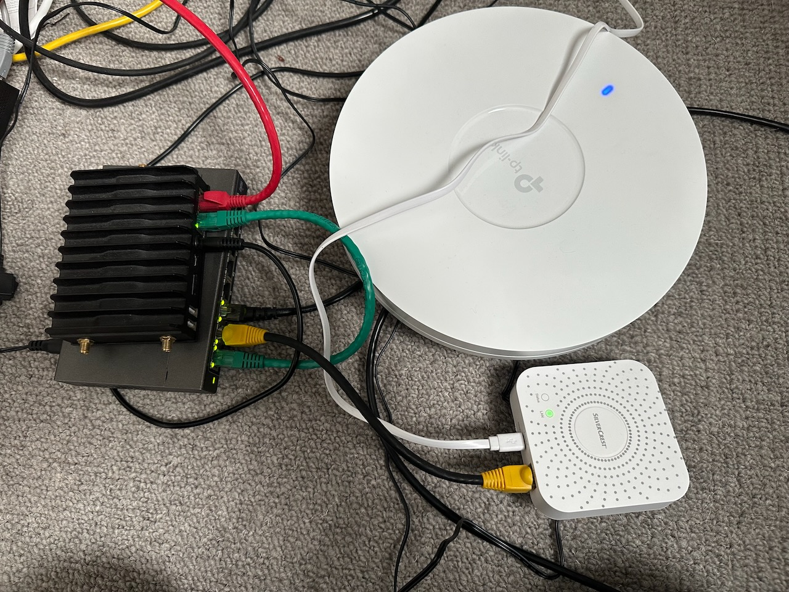

It's been a while since the last post, so I thought it was time for a lab update.
The lab hardware has mostly stayed the same since [the big threadripper build](/posts/threadripper-build),
but requirements are recently changing a bit so it is time for it to move on.

Very soon, I'm going to be giving up the flat lease and travelling full time while working remotely.
Sounds great and all, but it means there's nowhere to keep the home server.
As well as this, while I don't regret having the complex setup before,
it is getting too over-complicated for what I need.

# Goodbye Old Colo
Since the aim here is to simplify, two hosts are overkill.
There will only be one server colocated, and it may as well be the good one.
The old DL380p Gen8 has been gone from colo for a few months now,
and is currently sitting unused on my coffee table.

Funny story here. My colocation provider offered to delivery it back to me for £20.
I accepted as this seemed very reasonable, expecting him to bring it in a car or something.

Nope. Man carried the thing on the tube, and *borrowed* an M&S trolley before meeting me half way
where I had my own trolley to get it off him. Truly feel sorry for the guy.

# The New Colo

The Threadripper build is the only host remaining, so it needed a bit of updating before moving to colo.
The specs are mostly the same as before, but with a few additions and relocation into a 4U rack case.

* **Threadripper 2920X**
* **128GB RAM**
* Perc H310 with **6x 14TB HDD** (Up from 4x14TB)
* Perc H710p with **4x 1.92TB SSDs** (Samsung PM863a in RAID10, Up from 2 SSDs)
* **120GB boot SSD**
* **Nvidia A2000** GPU (New addition)

The main change here is the introduction of the A2000.
It's a bit pricey, but it has been very good at Plex transcoding for me.
The GPU powers off just the PCIe lane and sits at 6-7W idle, ~25W when transcoding a single 4k stream.
Having a GPU also means I don't have to worry about CPU usage to handle 4k content
and can obtain all my content in 4k, letting the GPU go brrr when needed.

The rest of the changes are very small upgrades.
Few new HDDs to increase storage space,
and the 2 extra SSDs weren't needed but came out of the old DL380p I had in colo.
The boot SSD is a change from just a USB, as ESXi 7 doesn't officially support USB booting anymore.
(It works, but the OS does tend to burn through USBs with reads/writes unlike before)

# No More Windows

One thing I've been looking to get rid of for a while now is all my Windows VMs.
I've had my fun with Active Directory and all that comes with it, but I really don't need
it anymore and I've had multiple Windows VMs running for what was effectively just DNS and DHCP.

The DNS and DHCP setup has now been replaced by [Gravity](https://github.com/BeryJu/gravity),
a pretty simple DNS and DHCP server that uses etcd and can be clustered.
I was originally excited for this project to be production ready to replace my multi-site 
DNS/DHCP setup but now the multi-site part isn't really needed for me anymore.

One thing that is left on a Windows VM is Veeam. 
Veeam is just far too good at backing up VMs for me to justify getting rid of it. 
The only difference now is it isn't AD joined.

# The Core VMs

Now that AD is gone, the list of core VMs has shrunk a lot, here is what I have in my base setup:

* **VyOS** - Still by far my favourite router software
* **Gravity** - I guess this container could be anywhere, but I feel more comfortable having a dedicated VM for DNS/DHCP
* **vCenter** - Self explanatory, wouldn't wanna run ESXi without it
* **NAS** - Currently running TrueNAS Scale in a VM, with the H310 passed through
* **Plex** - In a VM by itself, and not in docker because it's easier to use the GPU this way
* **Content stack** - One VM that has Sonarr/Radarr/Etc in docker containers
* **Veeam** - The only Windows VM left, does the VM backups

# The Home Setup

While the new colo setup has been great, I also needed a replacement setup for home.
After all, I still need internet until I move out in early Feb.
There really isn't a lot that I need at home now, so I decided to reuse the tiny host from
my [homelab in your pocket project](/posts/homelab-in-your-pocket).

Even this is probably overkill but it means not buying anything else instead, which is ideal.
I'm still running ESXi on it, purely because I still want a HomeAssistant setup at home for
smart bulbs and sensors.

Full hardware list for home:

* **Fitlet2** - The small (still overkill) host that's only running VyOS and HomeAssistant
* Netgear **8 port switch** - It's not much, but its enough
* **TP-Link EAP620 HD** - Had this AP since moving in and it's been great if not a bit overkill
* Silvercrest **Zigbee Hub** - This connects all my smart devices

There's really not a lot to it here and when I move out, it will all just get thrown in a box for the future.

# Conclusion

Overall I like this new setup. It's a lot simpler and means I can go travelling while still keeping the lab fully functional.
The new colocation box is still very well specced (too much, if anything), so there is plenty of room to set up more services.

Hopefully I never have to visit the server in colocation and it just keeps running fine. 
Its been running seamlessly for a little while now so I'm optimistic about it, and there is remote management on the motherboard if anything does happen.
For next steps, I should get around to setting up better monitoring for all this with Grafana/Prometheus, and some alerting.
