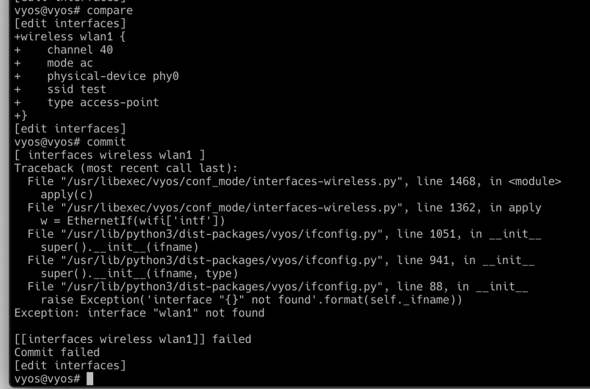

During the setup of a project of mine, I ran into an issue with VyOS where I couldn’t figure out how to setup multiple wireless interfaces. So after some digging around online and some help from a few people, I figured out a way to get it up and running.

# The goal
As part of this project, I needed to have multiple wireless interfaces in VyOS. I needed a WiFi client to act as one of the WAN connections, and an access point for connecting my laptop/phone to the network. You can find more details about the project as a whole in my [previous blog post](/posts/homelab-in-your-pocket).

# The problem
I found that in VyOS, there would be an interface called wlan0 that worked perfectly as both an access point, or a client, but not both at the same time. I was pretty sure this WiFi card could have multiple virtual interfaces. As well as that, the VyOS docs suggest that multiple virtual interfaces can be used for cards that support it.

I did some investigation, and found out about the iw command in linux, which is used to interact with wireless interfaces. Digging around with this command I found the following information about the WiFi card. This indicated to me it could support being both an access point and a client simultaneously.


When trying to add `wlan1` using VyOS config, I was getting this error as the interface was not defined.



It seemed like I would need to manually add this interface somehow.

# The solution

So after playing around with iw, I found I can just run a command to add an extra virtual interface for my physical WiFi card. The command I used for this was `sudo iw phy phy0 interface add wlan1 type managed`.
After adding this, the VyOS config change went through successfully. Nice. Or so I thought.

After rebooting the router, the interface was gone. Not only that, but VyOS removed the config for wlan1 since the interface no longer existed. Kind of annoying, but understandable.

I asked around in the /r/homelab Discord server and someone suggested I setup a systemd service that would add this interface on boot. Sounded like a great idea, and they were kind enough to write out a basic systemd entry for me. After some tweaking, I got this entry to work. The systemd service looks like the following:

```
[Unit]
Description=Create virual wireless interface
Before=vyos-router.service

[Service]
Type=oneshot
RemainAfterExit=no
ExecStart=/sbin/iw phy phy0 interface add wlan1 type managed

[Install]
WantedBy=multi-user.target
```

An important thing to note here is the `Before=vyos-router.service`. This makes sure the interface is create before VyOS sets up the config, meaning the config for wlan1 won’t be removed.

After rebooting to test it out, this solution worked a treat.

# Summary

Create a file called `/etc/systemd/system/createWlan.service` with the following contents:

```
[Unit]
Description=Create virual wireless interface
Before=vyos-router.service

[Service]
Type=oneshot
RemainAfterExit=no
ExecStart=/sbin/iw phy phy0 interface add wlan1 type managed

[Install]
WantedBy=multi-user.target
```

Enable the service using `systemctl enable createWlan.service`

After adding this and rebooting, you should be able to configure the wlan1 interface in VyOS with the options of your choosing.
