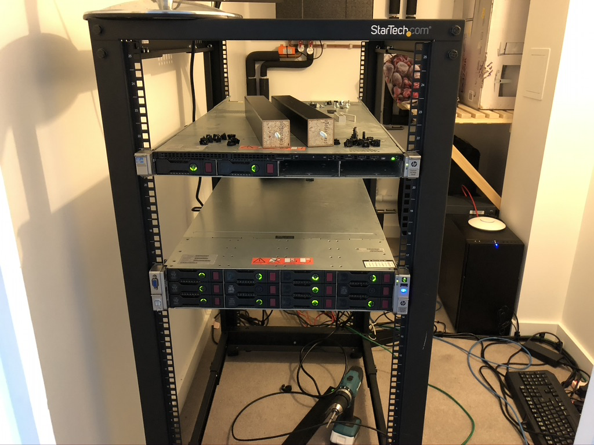
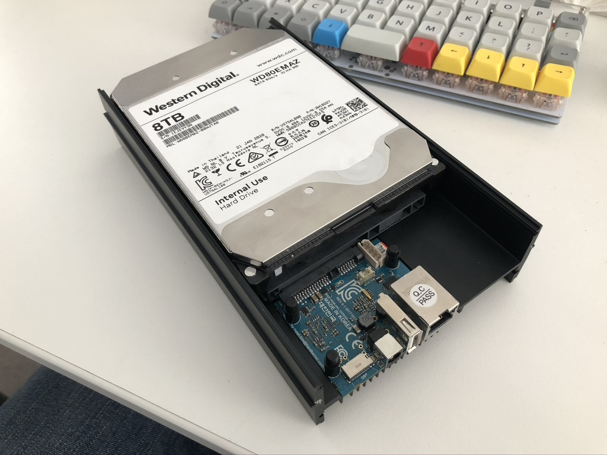
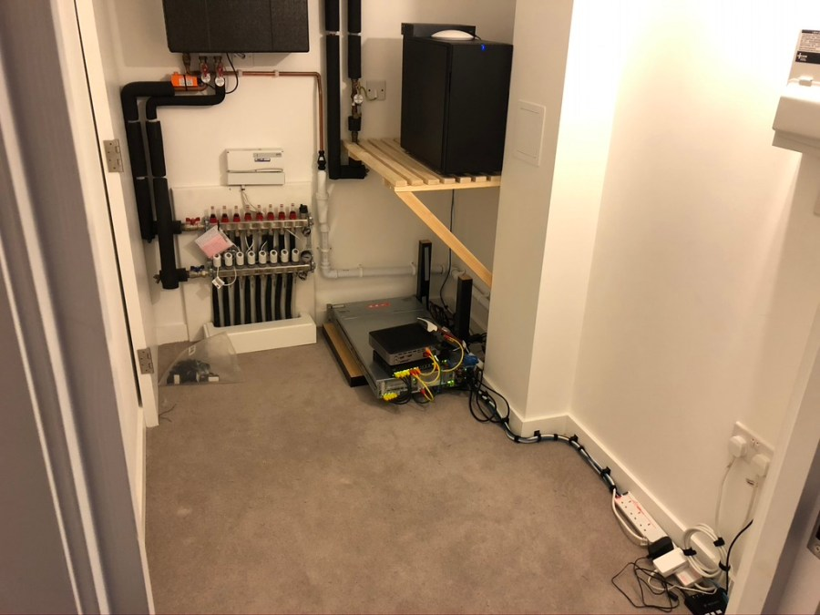
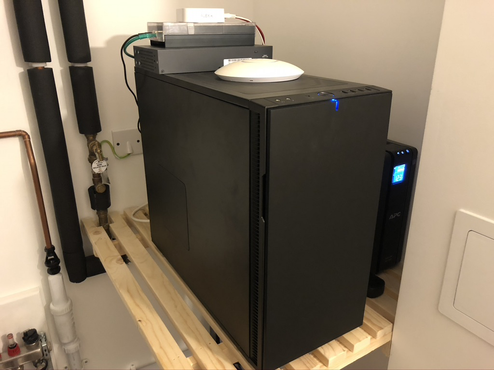

If you haven't read my previous posts, I recently [built a new home server](/posts/threadripper-build) with the goal of completely replacing my server rack. This server would completely replace my existing power-hungry vSAN cluster, as well as [replacing my NAS](/posts/threadripper-build-storage). This is what the newly built setup looks like, for the most part, as well as the existing rack for comparison.

As you can see, it's quite a compact setup, with just one tower, a switch, and an access point. You may be wondering how much of a downgrade this is when it comes to performance, memory, and storage. Well, not actually as much as you would think. Here are the specs of the new tower server:

* Threadripper 2920X (12c24t at 3.5GHz base)
* 128GB RAM, with room to go up to 256GB later
* 2x2TB Enterprise SSDs for VM storage
* 4x14TB HDDs, in a Debian VM with ZFS running

I'm not losing too much CPU, as the vSAN cluster was fairly low specced in that regard. I will also be gaining a lot of single-core performance for my VMs. The main thing I will be losing a lot of is RAM. However, I will no longer have the vSAN RAM overhead, so my memory usage should be much lower than before. I will also be offloading more workloads to colocation, to relieve the stress on the home setup.

# The migration

I am quite fortunate that I can get multiple public IPs from my ISP, which was really helpful for a smooth transition. I decided the best way to migrate was to have both the old lab and the new one running simultaneously. This would mean I could set up the new lab how I want without any downtime for existing services.

One of the main things I did to help ease this migration was to clean up my NAS and remove any old VMs I didn't need anymore. I ended up deleting around 10TB of data from my NAS, saving a lot of transfer time. The majority of VMs were also shut down, as I want a mostly fresh start with the new lab. This would be a convenient way to finally move my VMs to newer versions of Linux, and Windows Server 2019. The only VMs I kept during this transition were Plex, Jira, and this Site. Everything else was shut down. I will add, I have backups of all the old VMs, so the data can be retrieved later if needed.

As you can see, the data migration still took quite a while.

Before the switch over to the new setup, I had to setup some core VMs to make sure I was ready to go on the new setup. The core VMs I set up were:

* VyOS - My choice of router
* Domain Controller - This would also provide DNS and DHCP
* NAS - This held the data
* vCenter - This would be managing my ESXi host
* Management Windows VM - This would be used for managing things like DNS and DHCP

After all this was set up, and the data copied across, I switched over to using the new network. Once I was happy with it, I moved across the final key VMs, which were Jira and this website.

# Dismantling the rack

Now came the fun part. It was time to start tearing apart the old rack. The main thing to consider here was that I needed to wipe all of my drives properly. This would take some time, and for this reason, I left 2 servers running so that they could do the job. This is what the rack looked like after all the other servers were removed, and just these 2 were left. You can see the new build in the bottom right of the picture.

To wipe the drives, I used [PartedMagic](https://partedmagic.com/). It's a really nice tool, that can boot from an ISO and load into RAM. It has a lot of tools for wiping drives and getting stats off them. The wiping took quite a while with my 4TB drives, and was probably the most time consuming part of this migration.

After all was done, I had a huge pile of equipment in my room, all of which needed to be sold off somehow.

## Backup server

One of the things I still needed to find a replacement for was my backup server. Before, it was a 1U server with 4x2TB drives for storage. With the new setup, I ended up going with an ODroid HC2. This little device is tiny, low power, and can support a single 3.5" HDD. I went with an 8TB drive, as that made sense for capacity and pricing. Yes, I know, there is no drive redundancy here. But this will not be the only copy of the data, there will also be backups to colocation, and maybe cloud as well. So I think the risk is perfectly acceptable.

## UPS

While my previous setup did not have a UPS, I've always wanted to get one for the lab. With the new setup, this became so much easier as the power usage is so much lower. Before, I would have needed a big 2U or more UPS, which would have been expensive. But now, I can get away with just a 1500VA tower UPS.

## Top level router

One of the things that needed replacing, was my top-level router. The purpose of this is to split the incoming internet connection between me and my flatmate. This was being handled by a 1U server before, but this was complete overkill. With the new setup, I ended up getting an Edgerouter X, which is more than capable and uses 90W less than the old solution.

# Summary

Here are some before and after pictures of the lab cupboard.

As you can see, I've acquired a whole new cupboard I can use. The servers at the bottom belong to my flatmate and are not part of my new setup. Here is what the new lab looks like now, with both the backup server and the UPS.

The power usage of the new lab is so much lower than the previous one, at a measly 130W. I imagine this will go up as I deploy more VMs, but it is still a massive difference. My power bill went down £70 a month after the migration. The other thing that is really noticeable is the noise. There isn't any!

Overall this was quite an expensive project, costing around £4000 in the end. However, by selling off all of the old equipment the vast majority of that will be recovered, and the power savings will take care of the rest.

The next step will be to prepare a new colocation server, and replace my existing one for something more powerful. This will let me move a lot of the services to the datacenter, making this downgrade even more feasible in terms of performance. Look out for a post on that soon.
