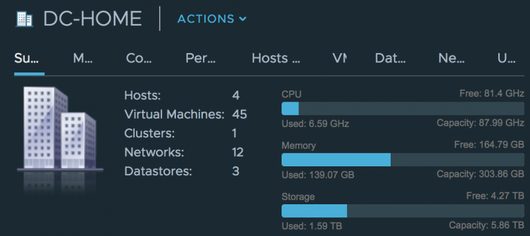
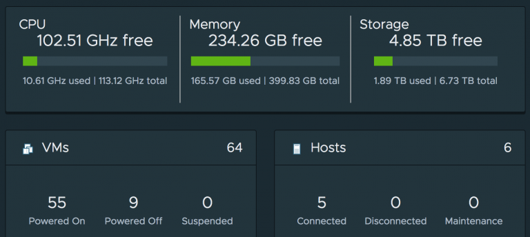

Over the last few years, my homelab has gone from zero to being out of control. Having a homelab allows me to learn a lot of skills such as networking and managing infrastructure for virtualised workloads. Here I will try and summary the lab hardware, and the software being used.

The “home”lab consists of 2 sites. One is at home, and the other is in a datacenter in central London. Most of the stuff is ran on the home cluster, with some stuff in colo. I have linked the sites with a site to site wireguard connection.

# Home

The home section of the lab consists of two main components. The first is a 3 node vSAN cluster, that I use for hosting all the VMs, and VM storage. The second part is the NAS, which has ample storage for all of my requirements.

The vSAN cluster is comprised of 3 identical nodes. They are all HP DL380p Gen8 rack mount servers, and their specs are as follow:

* 2x E5-2620v2 CPUs (6c/12t)
* 96GB RAM
* 1x Intel S4510 960GB SSD (Cache tier)
* 2x 900GB 10K SAS drives (Capacity tier)
* SD card (Boot disk)
* 2x 10Gb SFP+ NICs

The main NAS is also a DL380p Gen8 server, but a 12x 3.5″ bay variant, running freenas with 12x 4TB disks. Ideally I would migrate this to more dense disks, like 6x14TB or similar, but that is a problem for a future time.

There are several other items, such as a WiFi access point, another server for a router, and another DL380 for backup purposes.

I have all of these things connected over 10Gb with the combination of 2 switches. A Mikrotik CRS317, as the main backbone providing 16x SFP+ ports, and a CSS326 to provide 1Gb RJ45 access to other devices.

All of these things are currently housed in a 25U Startech rack, which I chosen entirely because it is able to be flatpacked if I ever need to move.

# Colo
For the colocated server, I have a 2U slot in a datacenter in central London, with a symmetric gigabit connection. This makes it ideal for hosting public services, although I haven’t had the time to transfer many across yet. I am using the space to host a DL360p Gen8 with the following specs:

* 2x E5-2620 v2
* 96GB RAM
* 2x 960GB pm863a
* 2x 8TB WD Red

This server is a VM host, and runs all the things I would need at a remote site, like a router/firewall, DNS, DHCP, etc. The 2 SSDs are mirrored and used for VM storage, while the 2 HDDs are mirrored and used for bulk storage.

# Software

As you may have guessed from me mentioning the vSAN cluster, my VM hosts are all running VMware ESXi. This allows me to do lots of fun stuff like clustering, high availablity, live migrations, and so on. I centrally manage all the hosts with vCenter, which also allows me to control the configuration using Terraform.

Resource summary for whole lab
One of the core things I run across the network is Windows Active Directory. This manages DNS, DHCP, and SSO, among other things. The main reasons for using it are the SSO and GPO. GPO makes managing any Windows VMs a breeze, and the single sign-on is very handy when handling file permissions for my storage provided by FreeNAS.

For the networking portion, I am running VyOS for the routers, which are also virtual machines. By having the routers as virtual machines, I can have regular backups, snapshots, and the ability to maintain uptime using both VMware HA and vMotion for when hosts are down for maintenance. You can read more about why I chose VyOS in [this post](/posts/goodbye-pfsense-hello-vyos).

# Other miscellaneous things

## WiFi
For WiFi, I have gone with a Unifi AP AC Lite, as this is more than enough to cover the flat. I manage it using a Unifi controller, which can be ran as a docker or VM.

## Power
For power distribution, I have 2 APC AP7920 PDUs. These have 8 output ports each, which is plenty for the whole rack. They are also managed, letting me monitor them and enable/disable power remotely if needed. This can be very handy to force a reboot.

# Future plans
There are a few things that I wanna do with the lab in the future. The main one is to migrate more of my services to the colocated server, and downscale the lab at home. While I really love all this hardware, the power consumption and noise could really be tuned down. Having a server rack also really limits my choices when choosing a place to live, although I was lucky to find the flat I live in currently.
