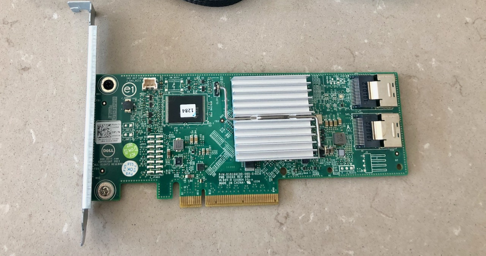
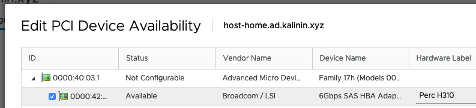
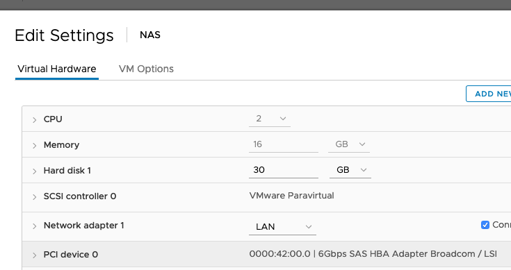
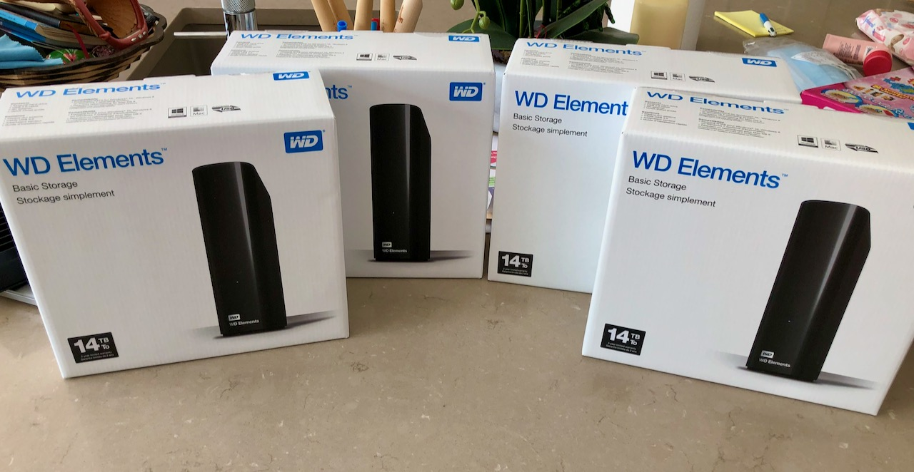
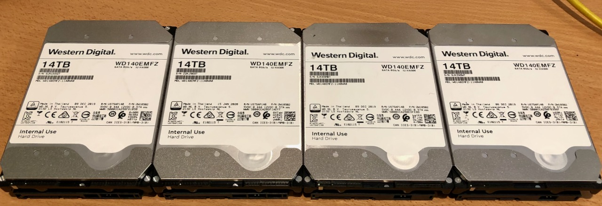
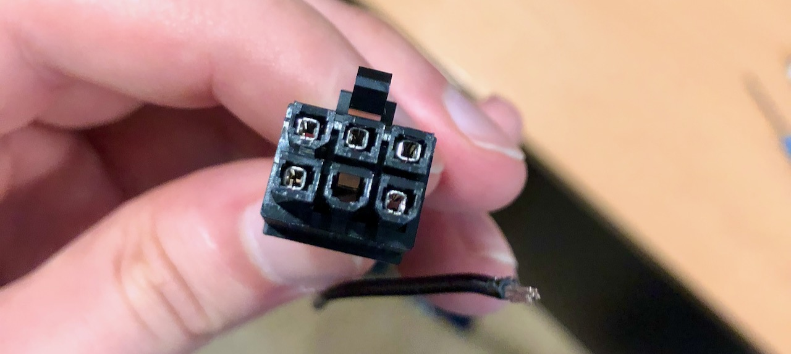
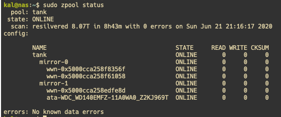
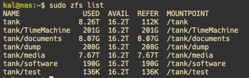

Adding ZFS bulk storage to my new ESXi Threadripper all in one homelab. Here is the journey I went through getting this to work, and the issues I ran into.

At this point, the Threadripper build is already running ESXi, and the next step is to add bulk storage for my new lab setup. For this build I decided to go with a VM running ZFS on Linux, either on Debian or Ubuntu. The reason I decided to change is FreeNAS is quite bloated fro my usecase. Sure, it does the job pretty well, but it includes lots of things that are simply not needed for a NAS, like containers and VM support.

# Passing the drives to the ZFS VM

Online lots of people will adamantly tell you that ZFS needs to be run on bare metal, and running it as a VM is blasphemy. This premise is false. It is perfectly fine to run it as a VM, there is just one main thing you should be aware of. When using ZFS for your storage, one of the key requirements is that the OS needs to have direct access to the disks. Feeding the disks through a RAID controller as individual RAID 0 disks is not suitable.

The most common solution to this problem, and the easiest in my opinion, is to connect the disks to a separate HBA. Then in your hypervisor, you can pass through the whole PCIe card to the VM running your ZFS pool. This ensures ZFS has full control of the disks, and there is nothing else in between.



My HBA of choice here is the Dell Perc H310. This RAID card can be flashed into HBA mode fairly easily, and a great guide can be [found here](https://techmattr.wordpress.com/2016/04/11/updated-sas-hba-crossflashing-or-flashing-to-it-mode-dell-perc-h200-and-h310/). 
The H200 used to be the card of choice, but this one is newer and their prices have dropped to be about the same. Another good choice would be to get an LSI HBA, but I have found they are harder to find in the UK, and these Dell cards are built off of LSI controllers anyway. This HBA cost me around £30, which is a pretty fair price.

Enabling PCIe passthrough for the HBA was very straightforward in ESXi. As of vSphere 7.0 this no longer requires a host reboot which is a very nice improvement from 6.7.




# Choosing the drives

When it comes to getting NAS drives, the cheapest way to get good drives is to shuck them from WD external drive enclosures. To summarise, this involves buying an external drive in an enclosure, and taking the drive out. This is very commonly done with WD Elements, WD MyBook, or WD EasyStore if you are in the US. I’m not entirely sure why, but these are often much cheaper than just buying the drive by itself.

In my case, I went the for densest drives I could shuck that were a reasonable price, which at the time were 14TB WD Elements drives. Here they are in all their unshucked glory.



In most cases these enclosures contain drives that are white labelled, but are the equivalent to WD Reds. Shucking them is fairly easy, you just need to stick a screwdriver or card in the gaps and pop it open. In my case, these were inside.



# The 3.3V Pin Problem

One of the few problems you might find with shucked drives is the 3.3V pin issue. This is an issue that can result in your drives not powering on with some power supplies. This is because the drives follow a newer SATA specification, in which the 3rd pin (3.3V) is used as a power disable signal. This means when older power supplies, that use the old spec, send power to this pin, the drive is powered off.

But fear not, there are several ways to resolve this issue. One way you will commonly see online is to put some tape over the 3rd pin to block the power. This does work, and leaves no lasting damage to the drive. However after trying this, I found the tape would come off whenever I unplugged the drive. I really didn’t want to have to redo this setup every time I unplugged the drives, so ruled this option out.

Another solution people mention is to just remove the pin on the drive. This also works, and is a permanent fix. However, I wanted to avoid this as this involves permanently damaging the drive.

The solution I ended up with is far more elegant in my opinion. I unplugged the 3.3V pin in my power supply cable like shown here:



The reason this works, is that none of the 3.3V pins on the SATA connector are actually used by the drive. This makes this cable of the power lead rather useless, except for causing the power disable issue.

I found that by doing this I didn’t have to damage the drives, the solution was permanent, and it fixed all 4 drives in one foul swoop. Because this is a modular power supply, I am only damaging a replaceable cable. In the end I just covered up the end of this cable, and the drives were all up and running as planned.

# Setting up the NAS VM

For the OS, I ended up going with Debian, as it’s a lot more lean and minimal than Ubuntu, which is perfect for what I need. After setting up the usual (sudo, user permissions, ssh, etc) it was time to setup zfs.

ZFS is surprisingly easy to setup, with just one or two commands you can have a working pool to use. For example, this was the command I ran for mine. tank in this command is the name for the pool.

```
sudo zpool create tank mirror /dev/sda /dev/sdb mirror /dev/sdc /dev/sdd
```

Then to create ZFS datasets, you can just do the following command, substituting the pool name and dataset name appropriately.

```
zfs create tank/Documents
```

You can then view the status of your pool with `zpool status`.




You can also view your datasets with `zfs list`.



When it comes to sharing this storage on the network, I chose to use Samba shares. Unlike NFS, they work great for both Linux, Windows, and MacOS machines. I ran into a few issues trying to get this working with Active Directory permissions, but I got there in the end. I will make a separate post about the process I ended up with, so watch out for that.

# Summary

With the storage added to the new Threadripper build, it is now in a state where it is capable of replacing the server rack. So the next steps will be to move the data across, as well as all the VMs I need. Look out for a post on this shortly.

